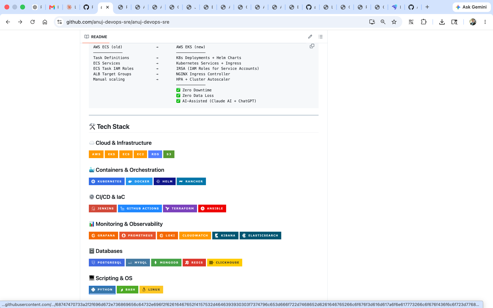
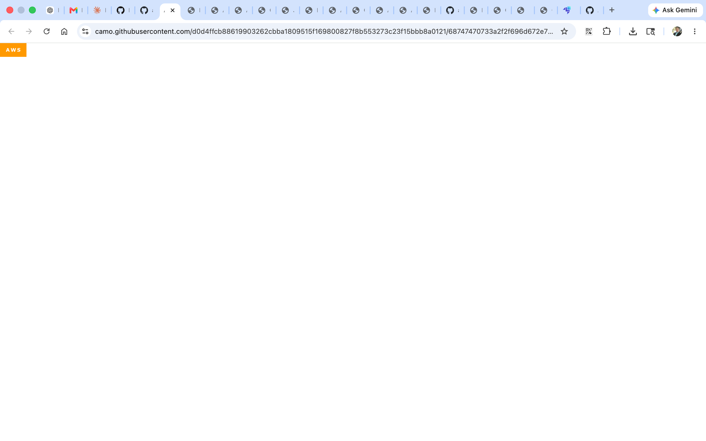

# 📸 Project Screenshots & Proof of Work

This directory contains visual evidence of labs, deployments, and successful configurations.

## 📂 Gallery

### 🚀 Lab Proofs (Click images to see Notes)
- **AWS / Cloud Infrastructure**: [](../aws/README.md)
- **Kubernetes / Containers**: [](../kubernetes/kubernats.md)
- **Monitoring & Observability**: [](../monitoring/README.md)

---

## 🛠️ How to add screenshots
1.  Is folder (`/screenshots`) mein apni image upload karein.
2.  `README.md` mein neeche diye gaye format mein link add karein:
    ```markdown
    
    
    
    ```
